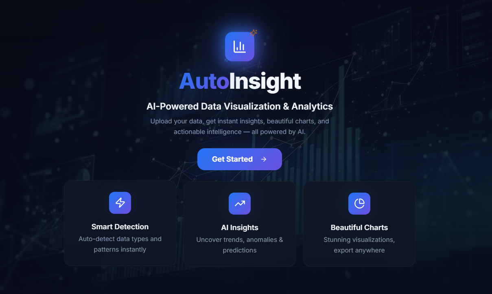
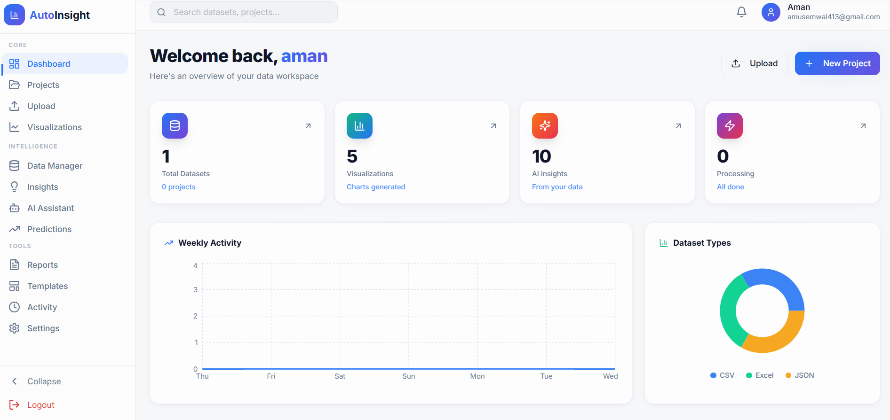
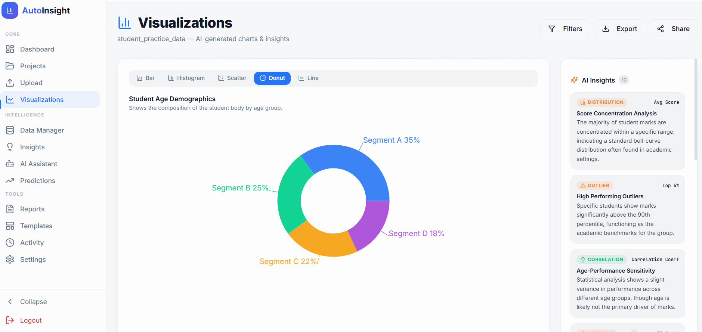
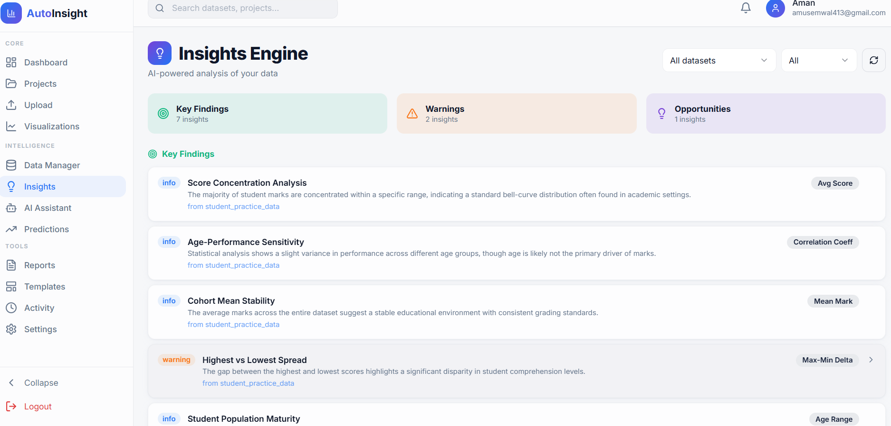
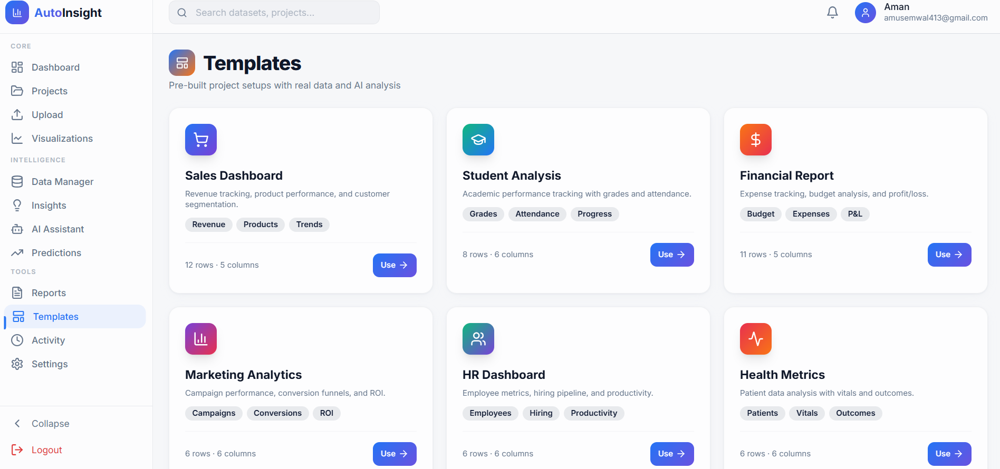

# 🚀 AutoInsight - AI Powered Data Visualization System

**AutoInsight** is a full-stack AI-powered analytics platform that transforms raw datasets into **interactive dashboards, visual insights, and predictive analytics** — all in one place.

---

## 🧠 Overview

AutoInsight allows users to:
- Upload datasets (CSV, Excel, JSON)
- Automatically analyze data using AI
- Generate insights and visualizations
- Perform data cleaning and transformations
- Predict trends using time-series forecasting
- Export reports in PDF/Markdown

It simplifies complex data analysis for **faster and smarter decision-making**.

---

## Project Demonstration
### First View


### 🏠 Dashboard


### 📈 Visualizations


### 🤖 AI Insights



### 📊 Templates


---


## ⚡ Key Features

### 🔐 Authentication
- Secure login/signup using Supabase
- Session management
- Password reset

### 📤 Dataset Upload & Processing
- Supports CSV, Excel, JSON
- Client-side parsing and validation
- Cloud storage using Supabase

### 🤖 AI-Based Insight Generation
- Detects trends and patterns
- Generates human-readable insights
- Suggests relevant charts

### 📊 Interactive Visualizations
- Dynamic dashboards
- Multiple chart types (Recharts)
- Responsive UI

### 🧹 Data Cleaning Tools
- Handle missing values
- Remove duplicates
- Column operations (rename/delete)

### 🔮 Prediction Module
- Time-series forecasting
- Actual vs predicted comparison
- Configurable parameters

### 📄 Reports Generation
- AI-enhanced reports
- Export to PDF / Markdown

### 📦 Templates
- Pre-built datasets
- Quick analysis setup

---

## 🛠 Tech Stack

### Frontend
- React + TypeScript
- Vite
- Tailwind CSS
- shadcn/ui
- Recharts
- Framer Motion

### Backend & Services
- Supabase (Auth, DB, Storage)
- Supabase Edge Functions (AI logic)

### Utilities
- XLSX (file parsing)
- jsPDF (PDF export)
- html2canvas (UI capture)

---


## 🔄 Workflow

1. User logs in
2. Uploads dataset
3. Data is parsed and validated
4. Stored in Supabase
5. AI analysis triggered
6. Insights + charts generated
7. User explores dashboard, predictions, reports

---

## ⚙️ Installation

```bash
git clone <your-repo-url>
cd insight-navigator-main
npm install
```

### Environment Variables
Create .env:
VITE_SUPABASE_URL=your_url
VITE_SUPABASE_PUBLISHABLE_KEY=your_key
VITE_SUPABASE_PROJECT_ID=your_project_id

Run
```
npm run dev
```

### 📂 Supported File Formats
CSV
Excel (.xlsx, .xls)
JSON
🤖 AI Capabilities
- Dataset analysis
- Insight generation
- Chart recommendation
- Report generation
- Time-series forecasting

AI logic is handled via Supabase Edge Functions (server-side)

### 🚀 Future Scope
- Real-time streaming analytics
- Advanced ML model integration
- Custom dashboard builder
- Collaboration features
- API access for external integrations

### 📌 Author
Aman 
